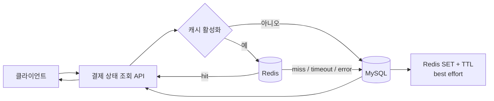
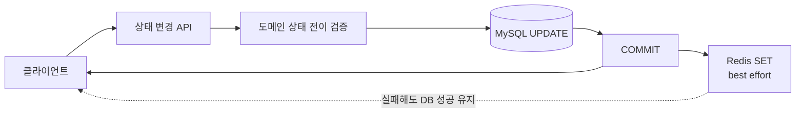

# Payment Status Cache Lab 결과

## 결론 요약

동일한 결제 상태 조회 API를 100 RPS로 호출했을 때 Redis cache-aside 정상 모드는 DB-only 대비 애플리케이션 DB 조회 QPS를 `100.0083`에서 `0.0083`으로 99.9917% 줄였다. 정상 시나리오 3회 중앙값 기준 평균 응답시간은 `6.3199ms`에서 `3.2311ms`, p95는 `19.2359ms`에서 `4.5394ms`로 감소했다.

Redis를 완전히 중단하거나 300ms 네트워크 지연을 주입해도 MySQL이 정상인 동안 완료된 HTTP 요청의 성공률은 100%였다. 다만 Redis 중단 시 평균 응답시간은 `813.6432ms`, 100ms command timeout 시나리오는 `2704.1618ms`였고 후자는 목표 100 RPS 중 `95.1333 RPS`만 처리했다. fallback은 가용성을 유지했지만 지연시간과 처리량까지 정상 상태와 동일하게 보장하지는 않았다.

## 실험 환경

원본은 [`results/20260905-222015/environment.json`](results/20260905-222015/environment.json)이다.

| 항목 | 값 |
| --- | --- |
| 실행 ID | `20260905-222015` |
| OS | Microsoft Windows 11 Home 64비트 build 26200 |
| CPU | 11th Gen Intel Core i5-1135G7 |
| 메모리 | 8,379,490,304 bytes |
| Docker / Compose | 24.0.7 / 2.23.3-desktop.2 |
| Java 이미지 | `eclipse-temurin:21.0.12_8-jre-jammy` |
| MySQL / Redis | `mysql:8.4.6` / `redis:7.4.5-alpine` |
| Toxiproxy / k6 | `ghcr.io/shopify/toxiproxy:2.12.0` / `grafana/k6:1.2.3` |
| 앱 / MySQL / Redis / k6 제한 | 1 CPU·512 MiB / 1 CPU·1 GiB / 0.5 CPU·256 MiB / 1 CPU·512 MiB |
| JVM 옵션 | `-XX:MaxRAMPercentage=75.0 -XX:ActiveProcessorCount=1` |

측정 당시 이 프로젝트 외 Docker 컨테이너 2개가 실행 중이었다. 절대 수치는 이 로컬 공유 호스트의 결과이며 다른 하드웨어의 보장값이 아니다.

## 실험 설계

- 동일한 Boot JAR 이미지, JVM 옵션, MySQL 데이터 100,000건, 결제 ID 1~1,000을 사용했다.
- DB-only와 Redis 정상은 각각 30초 워밍업 후 120초 본 측정을 3회 수행했다.
- 부하는 k6 `constant-arrival-rate` 100 RPS로 생성했다.
- 정상 비교값은 각 지표별 3회 중앙값이다. 한 행의 중앙값들이 반드시 같은 회차에서 나온 값은 아니다.
- Redis 중단과 timeout은 앱을 재시작하지 않고 각각 30초 측정했다.
- timeout 시나리오는 Toxiproxy downstream 300ms 지연과 Lettuce command timeout 100ms를 사용했다.
- 앱 DB QPS는 `payment_status_db_read_total` 증가량, 전체 SELECT QPS는 MySQL `Com_select` 전후 차이로 계산했다.
- CPU는 `docker stats`를 1초 간격으로 수집했다.

## 아키텍처와 실행 흐름

MySQL이 결제 상태의 원본이고 Redis는 TTL이 있는 파생 캐시다.

상태 변경은 DB commit을 먼저 확정하고 Redis를 나중에 갱신한다.

## DB-only와 Redis 정상 비교

| 지표 | DB-only 중앙값 | Redis 정상 중앙값 | 변화 |
| --- | ---: | ---: | ---: |
| 요청 수 | 12,001 | 12,001 | 동일 |
| 달성 RPS | 100.0083 | 100.0083 | 동일 |
| 성공률 | 100% | 100% | 동일 |
| dropped iteration | 0 | 0 | 동일 |
| 평균 응답시간 | 6.3199ms | 3.2311ms | 48.8742% 감소 |
| p50 | 4.2903ms | 2.3702ms | 44.7544% 감소 |
| p95 | 19.2359ms | 4.5394ms | 76.4014% 감소 |
| p99 | 41.6904ms | 18.6836ms | 55.1849% 감소 |
| 앱 DB QPS | 100.0083 | 0.0083 | 99.9917% 감소 |
| MySQL SELECT QPS | 100.0167 | 0.0167 | 99.9833% 감소 |
| cache hit ratio | 0 | 0.999917 | 99.9917% |
| 앱 CPU 평균 / p95 | 47.7763% / 98.28% | 26.7878% / 67.61% | 평균 43.9308% 감소 |
| MySQL CPU 평균 / p95 | 15.4181% / 21.66% | 1.898% / 4.72% | 평균 87.6898% 감소 |
| Redis CPU 평균 / p95 | 0.8315% / 1.8% | 2.4172% / 3.39% | 평균 190.7035% 증가 |

Redis 정상 모드는 조회 부하를 MySQL에서 Redis로 이동했다. 그 결과 DB QPS와 MySQL CPU가 크게 줄고 응답시간 중앙값도 감소했지만 Redis CPU는 증가했다. DB-only에서도 Redis 컨테이너를 동일 조건으로 유지했으나 Redis GET 명령은 0회였다.

### 회차별 원시 집계

| 시나리오 | 회차 | 요청 | 평균 ms | p95 ms | p99 ms | 앱 DB QPS | hit ratio | timeout |
| --- | ---: | ---: | ---: | ---: | ---: | ---: | ---: | ---: |
| DB-only | 1 | 12,001 | 5.1086 | 9.8323 | 35.2586 | 100.0083 | 0 | 0 |
| DB-only | 2 | 12,000 | 6.3199 | 19.2359 | 41.6904 | 100.0000 | 0 | 0 |
| DB-only | 3 | 12,001 | 44.7963 | 198.2641 | 959.7855 | 100.0083 | 0 | 0 |
| Redis 정상 | 1 | 12,001 | 3.2311 | 5.5197 | 25.5673 | 0.0083 | 0.999917 | 1 |
| Redis 정상 | 2 | 12,001 | 4.2953 | 4.3586 | 18.6836 | 0.0833 | 0.999167 | 10 |
| Redis 정상 | 3 | 12,001 | 2.8555 | 4.5394 | 10.5836 | 0.0000 | 1.000000 | 0 |

DB-only 3회차는 p95와 p99가 다른 두 회차보다 크게 증가했다. 요청률과 성공률은 유지됐지만 공유 호스트 노이즈가 존재하므로 단일 최고 결과를 고르지 않고 정해 둔 3회 중앙값을 사용했다. Redis 정상 1·2회차의 timeout 1건·10건은 DB fallback으로 처리돼 HTTP 성공률에는 영향을 주지 않았다.

## 장애 실험

| 시나리오 | 완료 요청 | 달성 RPS | dropped | 성공률 | 평균 / p95 / p99 | fallback | 앱 DB QPS |
| --- | ---: | ---: | ---: | ---: | ---: | ---: | ---: |
| Redis 완전 중단 | 2,991 | 99.7 | 11 | 100% | 813.6432 / 2862.9560 / 4875.8260ms | error 2,991 | 99.7 |
| Redis 100ms timeout | 2,854 | 95.1333 | 146 | 100% | 2704.1618 / 5111.2817 / 6475.5296ms | timeout 2,853, hit 1 | 95.1 |

Redis 중단 중 애플리케이션 liveness와 프로세스는 유지됐고 모든 완료 요청은 DB fallback으로 성공했다. Redis 복구 후 캐시되지 않은 ID의 첫 요청은 `MISS_FALLBACK`, 다음 요청은 `HIT`이었다.

timeout 시나리오의 100ms는 Redis 명령 하나의 제한이지 HTTP 요청 전체의 상한이 아니다. 측정 결과는 높은 동시성에서 fallback 경로의 전체 지연이 수 초까지 증가할 수 있음을 보여준다. 이 실험은 지연의 세부 구성요소를 분해하지 않았으므로 특정 내부 원인 하나로 단정하지 않는다.

## 상태 변경과 일관성

- 허용 전이는 `READY → AUTH → APPROVED`뿐이다.
- JPA `@Version` 충돌은 자동 재시도하지 않고 HTTP 409로 반환한다.
- DB transaction commit 이후 Redis를 갱신한다.
- rollback이면 Redis를 변경하지 않는다.
- commit 이후 Redis SET 실패는 이미 성공한 DB 변경을 API 실패로 바꾸지 않는다.
- Redis 장애 중에는 DB fallback으로 최신 원본을 읽을 수 있다.
- 기존 cache key 갱신만 실패하면 TTL 동안 stale 값이 남을 수 있다.
- timeout은 서버에서 명령이 실행되지 않았다는 보장이 아니다. 응답만 늦게 도착해 클라이언트가 실패로 판단할 수도 있다.
- TTL 5분은 stale 가능 시간을 제한하지만 DB와 Redis 사이의 강한 일관성을 만들지는 않는다.

Outbox, CDC, versioned key는 개선 방향이지만 이번 로컬 실험의 구현 범위에는 넣지 않았다.

## 테스트 결과

2026-09-07에 Gradle task를 강제 재실행한 결과 52개 테스트가 모두 통과했다.

| 테스트 그룹 | 개수 | 검증 내용 |
| --- | ---: | --- |
| 상태 전이 단위 테스트 | 9 | 정상·건너뛰기·역방향·종료 상태·동일 상태 |
| 조회 서비스 분기 | 4 | disabled·hit·timeout·connection error |
| Redis adapter | 8 | miss·JSON·timeout·오류·잘못된 값·쓰기 실패 |
| commit 후 동기화 단위 테스트 | 1 | Redis 실패 비전파 |
| MySQL/API 통합 테스트 | 6 | 조회·변경·rollback·404·400·optimistic locking |
| API 오류 매핑 | 3 | locking 409, transaction 시작 실패 503 |
| Redis/MySQL 캐시 통합 테스트 | 7 | miss→hit·TTL·commit·rollback·negative cache 없음 |
| 실제 장애·복구·동시성 통합 테스트 | 10 | 지연·거부·중단·동시 장애·복구·HTTP 충돌 |
| 인프라 smoke test | 4 | Spring context·Flyway·MySQL·Redis round-trip |
| 합계 | 52 | failures 0, errors 0, skipped 0 |

## 기술 선택 이유

- **MySQL 8.4 + JPA**: 결제 상태의 영속 원본과 optimistic locking을 실제 관계형 DB에서 검증하기 위해 선택했다.
- **Redis 7.4 + Lettuce**: 비동기 I/O 기반 클라이언트의 실제 command timeout과 자동 재연결 동작을 검증하기 위해 사용했다.
- **명시적 cache adapter**: `@Cacheable`로 숨기지 않고 hit·miss·timeout·error 및 fallback 사유를 코드와 metric에서 관찰하기 위해 분리했다.
- **Flyway**: schema와 100,000건 deterministic seed를 같은 migration 이력으로 재현하기 위해 사용했다.
- **Testcontainers + Toxiproxy**: mock 예외가 아니라 실제 MySQL·Redis와 네트워크 지연·연결 장애를 검증하기 위해 사용했다.
- **k6 constant-arrival-rate**: DB-only와 Redis 정상에 같은 목표 요청률을 적용하기 위해 사용했다.
- **Micrometer + Prometheus 형식**: payment ID를 label에 넣지 않고 제한된 결과·사유별 counter와 timer를 수집하기 위해 사용했다.

## 결과 무결성과 재현

- 원시 결과: [`results/20260905-222015/`](results/20260905-222015/)
- 집계 원본: [`scenario-results.json`](results/20260905-222015/scenario-results.json)
- CPU 원본: [`cpu.csv`](results/20260905-222015/cpu.csv)
- DB QPS 원본: [`db-qps.csv`](results/20260905-222015/db-qps.csv)
- 해시 목록: [`manifest.json`](results/20260905-222015/manifest.json)
- 전체 재현 절차: [`README.md`](README.md)

`scripts/verify-stage6.ps1`은 manifest 22개 파일의 byte/SHA-256, 원시 요청 수와 집계 JSON, 3회 중앙값, CPU·DB QPS 행 수, 이 문서의 핵심 수치를 대조한다.

## 이력서·포트폴리오용 사실 기반 요약

> Spring Boot 3.5·MySQL 8.4·Redis 7.4 기반 결제 상태 cache-aside 실험을 구현하고, Testcontainers/Toxiproxy로 timeout·연결 실패·중단·복구·동시 변경을 검증했다. 동일한 100 RPS 조건의 3회 중앙값에서 앱 DB 조회 QPS를 100.0083에서 0.0083으로 줄였고, Redis 장애 시 완료 요청의 DB fallback 성공률 100%와 지연·처리량 저하를 원시 JSON·CSV로 함께 보존했다.

이 문장은 이 로컬 실행 결과만 설명한다. 운영 트래픽 성능, 모든 하드웨어에서의 개선율 또는 무중단 보장을 주장하지 않는다.
